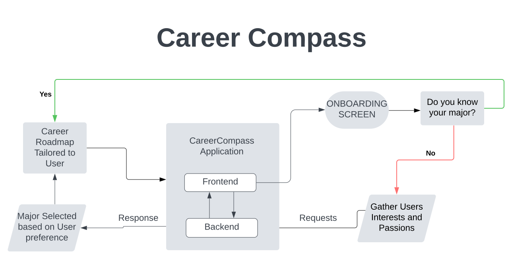

# MaroonHackathon

# 📍 Career Compass: Navigating Your Path to Success 🎓

Welcome to **Career Compass**, the ultimate AI-driven guide designed to help students navigate the often overwhelming world of major and career selection. Whether you're undecided, reconsidering your current path, or just need clarity on your next steps, Career Compass is here to chart a personalized roadmap to success!

---

## 🚀 What's Career Compass?
Career Compass is an innovative application that uses **AI technology** to:
- Assist students in identifying the best-fit major based on their **interests** and **passions**.
- Provide a personalized **course roadmap** for each year of study at their chosen university.
- Empower users to make informed decisions about their education and career.

With Career Compass, students can go from unsure to unstoppable!

---

## 🔮 Features
1. **AI-Driven Major Matching**:
   - Input your university of choice and your passions.
   - Let our AI, powered by **OpenAI API**, recommend the best-fit major.

2. **Personalized Career Roadmap**:
   - View a tailored, year-by-year plan:
     - Freshman
     - Sophomore
     - Junior
     - Senior
   - Each roadmap aligns with your major and desired career goals.

3. **Interactive UI**:
   - Onboarding screens for seamless data entry.
   - User-friendly design for a smooth experience.

4. **Backend-Powered Insights**:
   - Secure and efficient processing ensures accurate results.

---

## 🛠 Getting Started
Ready to get started? Follow these steps to set up Career Compass:

### Clone the Repository
```bash
git clone https://github.com/mulengangulale/MaroonHackathon.git
cd MaroonHackathon
```

2. **Set up your virtual environment:**
   ```
   python -m venv venv
   source venv/bin/activate  # On Windows, use `venv\Scripts\activate`
   ```
   It's like a treehouse for your code. No girls/boys allowed! (Just kidding, everyone's welcome.)

3. **Install dependencies:**
   ```
   pip install -r requirements.txt
   ```
   Warning: This may take a while. Perfect time to contemplate your life choices or make a sandwich.

4. **Run the backend:**
   ```
   python app.py
   ```
   

5. **Fire up the frontend:**
   ```
   npm install
   npm run dev
   ```

# 🌟 Visual Aid
Check out the flowchart below for a quick look at how Career Compass works:




The flowchart illustrates the user journey in Career Compass:
1. **Onboarding Screen**: Users provide their university preference, interests, and passions.
2. **AI Matching**: The system evaluates the input and recommends the most suitable major.
3. **Career Roadmap**: A tailored academic plan is generated for each year of study.
4. **Empowerment**: Users can make informed decisions about their future.

Feel free to explore this process and see how Career Compass simplifies your path to success! 🚀
